# UML diagram – Adatbázis séma

```mermaid
erDiagram
    User {
        Int     id          PK  "Egyedi azonosító (auto)"
        String  username    UK  "Egyedi felhasználónév"
        String  email       UK  "Egyedi e-mail cím"
        DateTime createdAt      "Létrehozás ideje"
        DateTime updatedAt      "Utolsó módosítás"
    }

    Authentication {
        Int     id           PK "Egyedi azonosító (auto)"
        Int     userId       FK "Kapcsolódó felhasználó"
        String  password         "HMAC-SHA256 hash"
        String  salt             "Véletlenszerű só"
        String  sessionToken     "Aktív session token"
    }

    GameSave {
        Int     id                PK "Egyedi azonosító (auto)"
        Int     userId            FK "Kapcsolódó felhasználó"
        Float   tokens               "Aktuális token egyenleg"
        Float   totalTokensEarned    "Összes szerzett token (életút)"
        Int     totalClicks          "Összes kattintás (életút)"
        Float   elapsedSeconds       "Eltelt játékidő, életút (másodperc)"
        Int     phdCount             "Összegyűjtött PhD-k száma"
        Int     prestigeCount        "Fokozatszerzések (prestige) száma"
        Float   runTokensEarned      "Aktuális menetben szerzett token"
        Int     runClicks            "Aktuális menetbeli kattintások"
        Float   runSeconds           "Aktuális menet ideje (másodperc)"
        Int     boostersCollected    "Összes begyűjtött booster száma (életút)"
        DateTime nextBoosterAt       "Legkorábbi időpont, amikor a következő booster igényelhető"
        DateTime savedAt             "Utolsó mentés ideje"
        DateTime updatedAt           "Automatikus frissítés"
    }

    UnitSave {
        Int     id          PK  "Egyedi azonosító (auto)"
        Int     gameSaveId  FK  "Kapcsolódó mentés"
        String  unitId          "Egység azonosítója (pl. alpha)"
        Int     owned           "Megvásárolt darabszám"
    }

    UpgradeSave {
        Int     id          PK  "Egyedi azonosító (auto)"
        Int     gameSaveId  FK  "Kapcsolódó mentés"
        String  upgradeId       "Fejlesztés azonosítója (pl. chalk)"
    }

    ActiveBooster {
        Int      id          PK  "Egyedi azonosító (auto)"
        Int      gameSaveId  FK  "Kapcsolódó mentés"
        String   boosterId       "Booster azonosítója (pl. frenzy)"
        DateTime expiresAt       "Lejárat időpontja"
    }

    UserSettings {
        Int      id                   PK "Egyedi azonosító (auto)"
        Int      userId               FK "Kapcsolódó felhasználó"
        String   theme                   "'dark' vagy 'light'"
        String   language                "'en' vagy 'hu'"
        Boolean  autosaveEnabled         "Automatikus mentés be/ki"
        Int      autosaveIntervalSecs    "Automatikus mentés gyakorisága (mp)"
        String   prestigeCeremony        "'full' vagy 'brief'"
        Boolean  hideFromLeaderboards    "Kizárás mások ranglistáiról"
        DateTime updatedAt               "Utolsó módosítás"
    }

    AntiCheatState {
        Int      id                PK "Egyedi azonosító (auto)"
        Int      userId            UK "Kapcsolódó felhasználó"
        Int      strikeCount           "Eddigi strike-ok száma"
        DateTime restrictedUntil       "Aktív korlátozás vége (NULL, ha nincs)"
        DateTime lastStrikeAt          "Utolsó strike időpontja (NULL, ha még sosem volt)"
        String   lastStrikeReason      "Az utolsó strike-ot kiváltó jelzés (max 64 karakter)"
        DateTime lastCleanAt           "A tiszta-nap-számláló horgonya"
        Int      suspicionScore        "Egymást követő gyanús ablakok száma"
        Int      softClampCount        "LÉNYEGES csendes korrekciók száma a jelenlegi ablakban"
        DateTime softClampWindowStartedAt "A gördülő csendes-korrekció-ablak kezdete (NULL, ha még sosem volt lényeges korrekció)"
        Int      highRateWindows       "Egymást követő magas-ráta ablakok száma"
        DateTime updatedAt             "Automatikus frissítés"
    }

    AntiCheatEvent {
        Int      id          PK "Egyedi azonosító (auto)"
        Int      userId      FK "Kapcsolódó felhasználó"
        DateTime createdAt      "Létrehozás ideje"
        String   kind            "Verdikt típusa (pl. envelope_reject, statistical_verdict)"
        String   severity        "'info' vagy 'strike'"
        String   mode            "Az ANTICHEAT_MODE, ami alatt keletkezett"
        Json     detail          "Diagnosztikai részletek (sosem mentési adat)"
        Boolean  enforced        "Ténylegesen alkalmazva lett-e (enforce mód)"
    }

    User ||--o| Authentication  : "rendelkezik"
    User ||--o| GameSave        : "rendelkezik"
    User ||--o| UserSettings    : "rendelkezik"
    User ||--o| AntiCheatState  : "rendelkezik"
    User ||--o{ AntiCheatEvent  : "kiváltja"
    GameSave ||--o{ UnitSave    : "tartalmaz"
    GameSave ||--o{ UpgradeSave : "tartalmaz"
    GameSave ||--o{ ActiveBooster : "tartalmaz"
```



## Táblák leírása

### `User`
A regisztrált felhasználók alapadatait tárolja. A `username` és az `email` mező egyedi kényszert kapott, hogy ne lehessen kétszer regisztrálni ugyanazt az e-mail címet vagy felhasználónevet.

### `Authentication`
A `User` táblával 1:1 kapcsolatban álló tábla, amely a hitelesítéshez szükséges érzékeny adatokat tartalmazza. A `password` mező nem nyers jelszót, hanem HMAC-SHA256 hash-t tárol, amelyhez a `salt` adja a sót. A `sessionToken` tartalmazza a bejelentkezéskor kiadott tokent; kijelentkezéskor ez üres stringre módosul (invalidálás).

### `GameSave`
Felhasználónként legfeljebb egy mentés létezhet (1:1 kapcsolat a `User` táblával). Az összesített játékstatisztikákat (egyenleg, összes szerzett token, kattintások száma, eltelt idő) tárolja. A `savedAt` mező minden `PUT /save` hívásnál frissül.

A `totalTokensEarned`/`totalClicks`/`elapsedSeconds` mezők **életút-szintűek**: soha nem állnak vissza. A `phdCount`/`prestigeCount` mezők a prestige-rendszer (lásd `PUT /save` és a frontend `gameStore.prestige()`) által megszerzett, szintén életút-szintű PhD-kat és fokozatszerzéseket számolják. A `runTokensEarned`/`runClicks`/`runSeconds` mezők az **aktuális menetre** vonatkoznak: fokozatszerzéskor (`prestige()`) nullázódnak, míg a fenti életút-mezők változatlanok maradnak. Egy PhD-t korábban nem használt (a prestige-rendszer bevezetése előtti) mentésnél a `run*` mezők a megfelelő életút-mezőkből lettek visszatöltve, mivel egyetlen, még le nem zárt menetnek felelnek meg.

A `totalTokensEarned`, `totalClicks`, `phdCount` és `elapsedSeconds` mezőkön egy-egy index (`@@index`) is létezik — ezek szolgálják ki a `GET /leaderboard` rangsoroló (`ORDER BY ... DESC LIMIT`) lekérdezéseit.

A `boostersCollected` és `nextBoosterAt` mezők a booster-rendszer (lásd `POST /boosters/claim` és a fejlesztői dokumentáció "Anti-cheat modell" → "Boosterek" szakasza) állapotát tárolják. A `nextBoosterAt` az egyetlen kapu, amely eldönti, mikor igényelhető a következő booster — ezt kizárólag a szerver módosítja, a `PUT /save` sosem írja. Egy meglévő mentésnél a mezőt bevezető migráció a jelenlegi időre állította be az alapértéket, így minden korábbi mentés azonnal jogosulttá vált az első booster igénylésére.

### `UnitSave`
Az egyes egységtípusokhoz tartozó megvásárolt darabszámokat tárolja. Egy `GameSave`-hez több `UnitSave` sor is tartozhat (1:N kapcsolat). A `gameSaveId + unitId` páros egyedi kényszert kapott, hogy egy mentésen belül minden egységtípus legfeljebb egyszer szerepeljen. Ha a szülő `GameSave` törlésre kerül, az összes kapcsolódó `UnitSave` sor automatikusan törlődik (`ON DELETE CASCADE`).

### `UpgradeSave`
Az egyszeri megvásárlású kattintás-erő fejlesztéseket (upgrade-eket) tárolja — egy sor jelenléte jelenti, hogy a fejlesztés meg van véve, nincs külön darabszám-mező (ellentétben a `UnitSave`-vel). A `gameSaveId + upgradeId` páros egyedi kényszert kapott. Fokozatszerzéskor (prestige) a frontend `gameStore.prestige()` az összes ehhez a mentéshez tartozó sort törli (a következő `PUT /save` hívás rögzíti az üres listát), ugyanúgy, mint az egységeknél. Ha a szülő `GameSave` törlésre kerül, az összes kapcsolódó sor automatikusan törlődik (`ON DELETE CASCADE`).

### `ActiveBooster`
A jelenleg aktív, időzített booster-bónuszokat tárolja. **Kizárólag** a `POST /boosters/claim` végpont hozhatja létre vagy frissítheti (lásd a fejlesztői dokumentáció "Anti-cheat modell" → "Boosterek" szakaszát) — a `PUT /save` sosem ír ebbe a táblába. A `gameSaveId + boosterId` páros egyedi kényszert kapott: egy már aktív típus újra-igénylése a meglévő sor `expiresAt` mezőjét frissíti, nem hoz létre új sort. A `GET /save` csak a még nem lejárt (`expiresAt` a jelenlegi időnél későbbi) sorokat adja vissza, és `remainingMs` hátralévő időként, sosem abszolút időpontként — a kliens ezt a saját órájához rögzíti, hogy egy óraeltérés se hosszabbíthassa meg a bónuszt. Ha a szülő `GameSave` törlésre kerül, az összes kapcsolódó sor automatikusan törlődik (`ON DELETE CASCADE`).

### `UserSettings`
Felhasználónként legfeljebb egy beállítás-rekord létezik (1:1 kapcsolat a `User` táblával), amely a kliens-oldali preferenciákat (téma, nyelv, automatikus mentés, fokozatszerzés-ünneplés módja) tárolja szerver oldalon, hogy azok eszközök között szinkronizálódjanak bejelentkezett felhasználóknál. Vendégjátékosoknál ezek a beállítások csak a böngésző `localStorage`-ában élnek. Ha még nem létezik rekord egy felhasználóhoz, a `GET /settings` az alapértelmezett értékeket adja vissza `updatedAt: null` mellett. Ha a szülő `User` törlésre kerül, a `UserSettings` sor is automatikusan törlődik (`ON DELETE CASCADE`) — eltérően az `Authentication`/`GameSave` táblák `RESTRICT` viselkedésétől, mivel a beállítások a tulajdonos nélkül értelmezhetetlenek.

A `hideFromLeaderboards` mező (alapértéke `false`) zárja ki a felhasználót mások `GET /leaderboard` rangsorából — a `GameSave`-hez hasonlóan ez a mező is opcionális 1:1 kapcsolaton keresztül érhető el, így egy olyan felhasználó, akinek még nincs `UserSettings` sora, láthatónak számít (nem kizártnak).

### `AntiCheatState`
Fiókonkénti strike-/korlátozás-állapot (lásd a fejlesztői dokumentáció "Anti-cheat modell" szakaszát), 1:1 kapcsolatban a `User` táblával. **Lustán** jön létre — az első csendes korrekciónál vagy strike-nál —, így a legtöbb fiókhoz sosem tartozik sor. A `restrictedUntil` az egyetlen kapu, amit minden írási végpont ellenőriz (`requireNotRestricted` middleware); `NULL` (nem "a múltban") jelenti, hogy nincs aktív korlátozás, így egy tiszta fiók ellenőrzése egy olcsó `NULL`-teszt, nem időbélyeg-összehasonlítás. A `lastCleanAt` a 30 egymást követő tiszta napos strike-csökkenési ablak horgonya — minden új strike `most()`-ra állítja vissza (egy csendes korrekció, lényeges vagy sem, **nem** — lásd lent), egy tiszta lejárat pedig `STRIKE_DECAY_DAYS` egész többszörösével tolja előre (sosem veszik el egy részleges tiszta időszak). Ha a szülő `User` törlésre kerül, a sor is automatikusan törlődik (`ON DELETE CASCADE`).

A `softClampCount`/`softClampWindowStartedAt` pár egy gördülő, `ANTICHEAT_STATE_WINDOW_HOURS` (24 órás) ablakban számolja a **lényeges** (a határt `SOFT_CLAMP_MATERIAL_RATIO`-nál nagyobb hányaddal meghaladó) csendes korrekciókat — egy nem lényeges korrekció (pl. lebegőpontos kerekítési zaj) sosem növeli, egy az ablaknál régebbi lényeges korrekció pedig nem kombinálódik egy újjal. `softClampWindowStartedAt` `NULL`, amíg a fiókon még sosem történt lényeges korrekció.

### `AntiCheatEvent`
Csak-hozzáfűzős napló minden anti-cheat verdiktről — beleértve a `monitor` módban elfojtottakat is (`enforced: false`) —, ez teszi lehetővé a küszöbök éles forgalom elleni hangolását anélkül, hogy bárkit ténylegesen korlátozni kellene előtte. **Sosem** tárol mentési adatot, csak azt, mely jelzések aktiválódtak és a burok által számolt határértékeket (`detail`, szabad-formátumú JSON). A `severity` "info", amíg a `services/antiCheat.ts` strike-létrája ténylegesen büntetést nem alkalmaz egy eseményre, ekkor válik "strike"-ká. Ha a szülő `User` törlésre kerül, a kapcsolódó sorok is automatikusan törlődnek (`ON DELETE CASCADE`).

## Kapcsolatok összefoglalója

| Forrás | Célpont | Kardinalitás | Leírás |
|---|---|---|---|
| `User` | `Authentication` | 1 : 0..1 | Egy felhasználóhoz legfeljebb egy hitelesítési rekord tartozik |
| `User` | `GameSave` | 1 : 0..1 | Egy felhasználónak legfeljebb egy aktív mentése lehet |
| `User` | `UserSettings` | 1 : 0..1 | Egy felhasználónak legfeljebb egy beállítás-rekordja lehet |
| `GameSave` | `UnitSave` | 1 : 0..N | Egy mentés tetszőleges számú egységrekordot tartalmazhat |
| `GameSave` | `UpgradeSave` | 1 : 0..N | Egy mentés tetszőleges számú megszerzett fejlesztést tartalmazhat |
| `GameSave` | `ActiveBooster` | 1 : 0..N | Egy mentéshez egyszerre több, különböző típusú aktív booster is tartozhat |
| `User` | `AntiCheatState` | 1 : 0..1 | Egy felhasználónak legfeljebb egy strike-/korlátozás-állapot rekordja lehet (lustán jön létre) |
| `User` | `AntiCheatEvent` | 1 : 0..N | Egy felhasználóhoz tetszőleges számú naplózott anti-cheat verdikt tartozhat |
```
